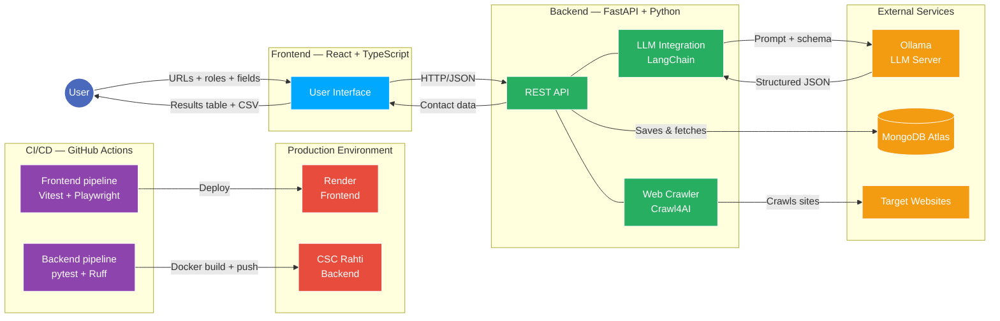

# ContactSearch

[](https://github.com/OhjProj2/ContactSearchFrontend/actions/workflows/ci.yml)
[](https://github.com/OhjProj2/ContactSearchFrontend/actions/workflows/playwright.yml)

ContactSearch is a website, made for easy contact information search on different sites. It uses AI to gather and structurize the information.

## Technologies

### Architecture



### Languages

- Typescript
- HTML
- CSS

### Libraries

- React
- HeroUI
- TailwindCSS
- Papaparser

### Testing

#### Unit / Component tests

- Vitest
- React Testing Library
- jest-dom
- jsdom

#### End-to-End tests

- Playwright

After installing dependencies, install browsers:

```bash
npx playwright install
```

Playwright tests simulate real user interactions in the browser.  
Backend API calls are mocked to ensure stable and fast test execution.

## Installation

You can install frontend with next steps:

Clone the project

```bash
  git clone https://github.com/OhjProj2/ContactSearchFrontend.git
```

Go to the project directory

```bash
  cd ContactSearchFrontend
```

Install dependencies

```bash
  npm install
```

## Run Locally

Start the server

```bash
  npm run dev
```

or

```bash
  npm run start
```

## Run Unit Tests Locally

```bash
npm test
```

## Run E2E Test Locally

- The frontend must be running locally (`npm run dev`)
- The backend is NOT required, as API calls are mocked using Playwright route interception

```bash
npx playwright test
```

## Authors

- [@Prshkv](https://www.github.com/Prshkv)
- [@eetuhellberg](https://www.github.com/eetuhellberg)
- [@Energyjoe](https://www.github.com/Energyjoe)
- [@Matimane](https://www.github.com/Matimane)
- [@VeeraElo](https://www.github.com/VeeraElo)

ContactSearch is licensed under [MIT license](./LICENSE.md).

